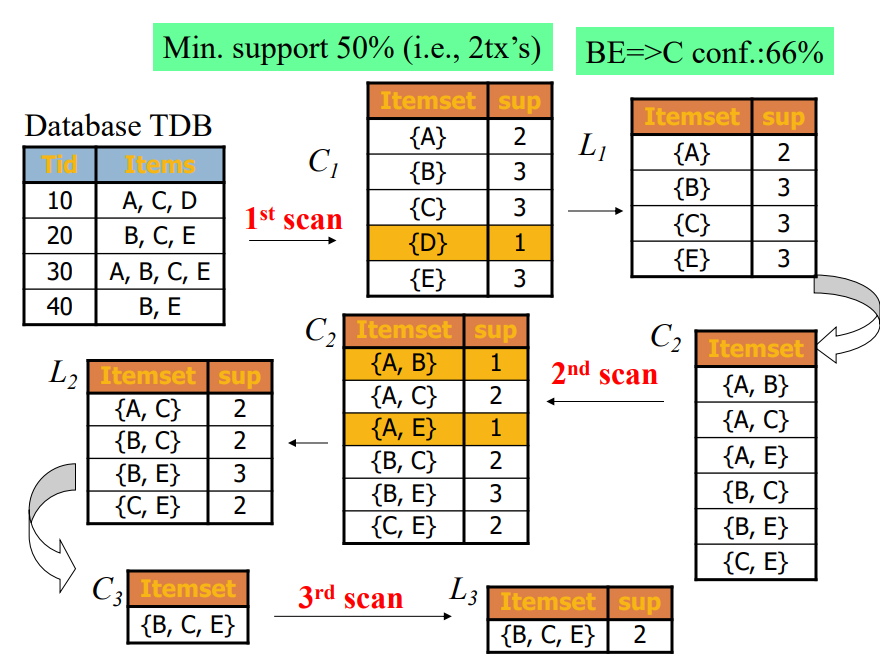

<p align=center>
    
</p>

<p align=center>
    <a target="_blank" href="https://pypi.org/project/apriori-python/" title="pip"></a>
    <a target="_blank" href="#" title="language count"></a>
    <a target="_blank" href="#" title="top language"></a>
    <a target="_blank" href="https://opensource.org/licenses/MIT" title="License: MIT"></a>
    <a target="_blank" href="#" title="repo size"></a>
    <a target="_blank" href="http://makeapullrequest.com" title="PRs Welcome"></a>
</p>

## Getting Started

### Install the Pypi package using pip

```
pip install apriori_python
```

Then use it like 

```python
from apriori_python import apriori
itemSetList = [['eggs', 'bacon', 'soup'],
                ['eggs', 'bacon', 'apple'],
                ['soup', 'bacon', 'banana']]
freqItemSet, rules = apriori(itemSetList, minSup=0.5, minConf=0.5)
print(freqItemSet)
print(rules)  
# [[{'beer'}, {'rice'}, 0.6666666666666666], [{'rice'}, {'beer'}, 1.0]]
# rules[0] --> rules[1], confidence = rules[2]
```

### Clone the repo

Get a copy of this repo using git clone
```
git clone https://github.com/chonyy/apriori_python.git
```

Run the program with dataset provided and **default** values for *minSupport* = 0.5 and *minConfidence* = 0.5

```
python apriori.py -f dataset.csv
```

Run program with dataset and min support and min confidence  

```
python apriori.py -f ../dataset/tesco2.csv -s 0.5 -c 0.5
```

## Concepts of Apriori

* **Support:** Fraction of transactions that contain an itemset
* **Confidence:** Measures how often items in Y appear in transactions that contain X
* **Frequent itemset:** An itemset whose support is greater than or equal to a minSup threshold
